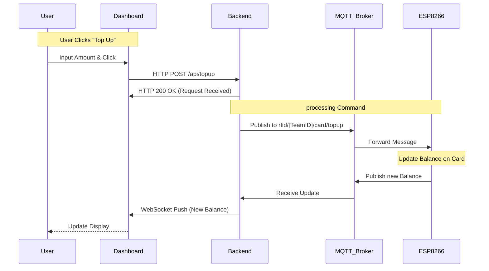

# EdgeWallet RFID System

**Team ID:** `[Insert Your Team ID]`

## 1. Project Overview

This project implements a complete **Edge-to-Cloud IoT solution** for managing RFID card balances. It creates a seamless interaction between physical hardware and a web-based dashboard.

**Key Features:**
*   **Tap & View**: Users can tap an RFID card on an ESP8266 edge device to see their balance.
*   **Web Dashboard**: A real-time web interface to view current balances.
*   **Cloud Top-Up**: Users can add funds ("top-up") to a card through the dashboard, which instantly updates the physical device.

---

## 2. System Architecture

The system uses a 3-tier architecture designed for security, efficiency, and real-time communication.

```mermaid
graph TD
    subgraph "Edge Layer"
        ESP[ESP8266 Controller]
        RFID[RFID Reader (RC522)]
        ESP -- SPI --> RFID
    end

    subgraph "Cloud Layer (VPS)"
        Wrapper[Backend Service]
        Broker[MQTT Broker]
    end

    subgraph "User Layer"
        Dash[Web Dashboard]
    end

    %% Communication Flows
    ESP <-- "MQTT (Topics)" --> Broker
    Broker <-- "Local MQTT" --> Wrapper
    Wrapper <-- "HTTP POST & WebSockets" --> Dash

    %% Styling
    style ESP fill:#f9f,stroke:#333,stroke-width:2px
    style Wrapper fill:#bbf,stroke:#333,stroke-width:2px
    style Dash fill:#bfb,stroke:#333,stroke-width:2px
```

### Components

| Component | Technology | Role |
| :--- | :--- | :--- |
| **Edge Controller** | ESP8266 / MicroPython | Reads RFID tags and communicates with the cloud via MQTT. |
| **Cloud Backend** | Python (Flask/FastAPI) | Bridges the MQTT world (device) and the HTTP/WebSocket world (user). |
| **Web Dashboard** | HTML / JS | User interface for monitoring balances and issuing top-ups. |

---

## 3. Communication Protocols

This project strictly follows the "Golden Rule" of protocol isolation to ensure stability.

| Communication Path | Protocol | Purpose |
| :--- | :--- | :--- |
| **ESP8266 $\leftrightarrow$ Backend** | **MQTT** | Lightweight messaging for hardware constraints. Sends UID/Balance; receives Top-ups. |
| **Dashboard $\rightarrow$ Backend** | **HTTP (POST)** | User actions (e.g., clicking "Top-up"). |
| **Backend $\rightarrow$ Dashboard** | **WebSocket** | Real-time push logic to update the browser instantly when a card is tapped. |

### Top-Up Sequence Diagram

The following diagram illustrates exactly what happens when a user tops up a card:



---

## 4. MQTT Topic Isolation

All teams share the same MQTT broker (`157.173.101.159`). To prevent collision, we strict namespace isolation.

**Base Topic:** `rfid/[Your_Team_ID]/`

| Purpose | Topic | Direction |
| :--- | :--- | :--- |
| **Card Status** | `.../card/status` | ESP8266 $\rightarrow$ Broker |
| **Top-up Command** | `.../card/topup` | Backend $\rightarrow$ ESP8266 |
| **Updated Balance** | `.../card/balance` | ESP8266 $\rightarrow$ Broker |

> **Important:** Replace `[Your_Team_ID]` with your assigned team identifier in all code files.

---

## 5. Folder Structure

```text
Edge-2-Cloud-RFID/
├── firmware/       # ESP8266 MicroPython code & libraries (MFRC522)
├── backend/        # Python Server (Flask/FastAPI) host logic
├── frontend/       # Web Dashboard (HTML/CSS/JS)
└── docs/           # Additional documentation
```

---

## 6. How to Run

### Prerequisite
Ensure you have Python installed and the hardware fully wired.

### Step 1: Frontend
Open `frontend/index.html` in your browser.
*   *Alternatively, access the live deployment if available.*

### Step 2: Backend
1.  Navigate to the backend folder:
    ```bash
    cd backend
    ```
2.  Install dependencies:
    ```bash
    pip install -r requirements.txt
    ```
3.  Start the server:
    ```bash
    python app.py
    ```

### Step 3: Firmware (Edge)
1.  Flash your ESP8266 with the contents of the `/firmware` folder.
2.  Ensure your `wifi_credentials.py` (or equivalent) is configured.
3.  Reset the board to connect to the broker.

---
*Project for Embedded System Software Integration Course*